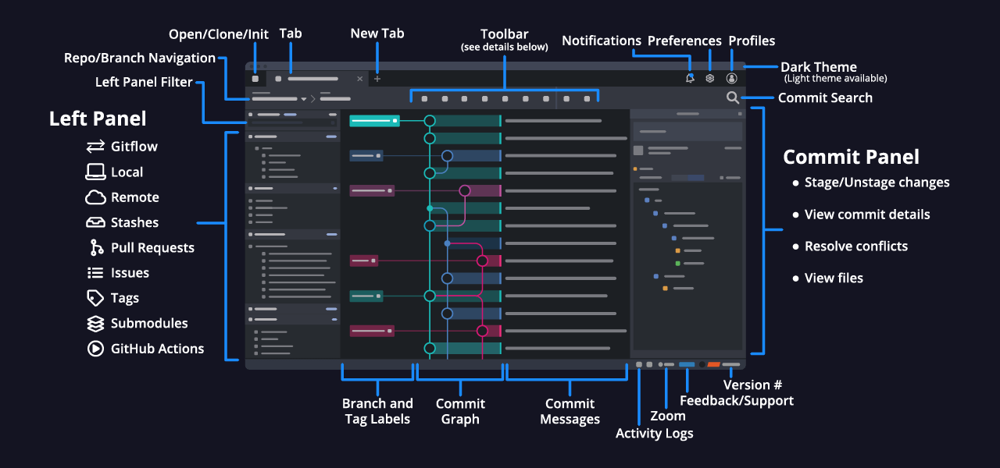
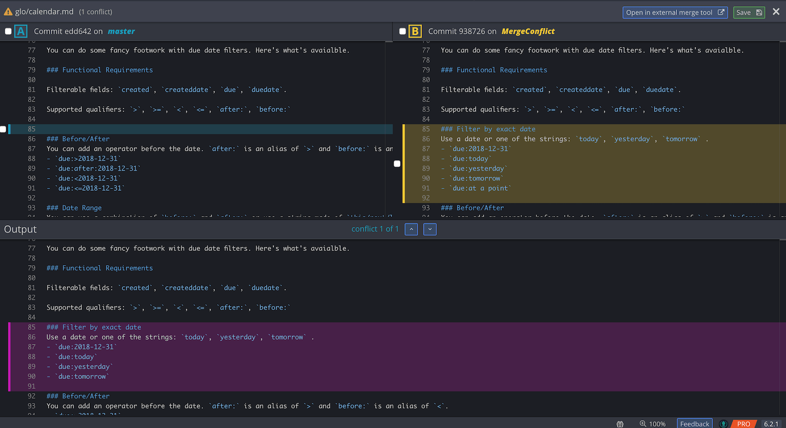
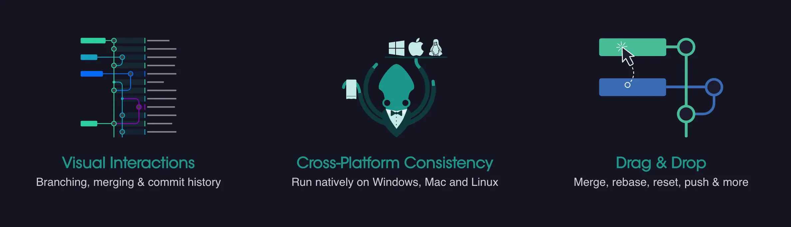

I did not use the GUI to work with git. When I was just starting to program, there was nothing interesting for Linux,
but theoretically, I was immediately taught to the command line, so no interfaces were required.

Then [gitg](https://wiki.gnome.org/Apps/Gitg) and IDEA came along with its integration with git, and this perfectly
complemented my work on the command line.

However, I still follow different projects, especially if they are written on the technologies of the front. So, I
stumbled upon GitKraken. Cross-platform git interface.

## GitKraken

GitKraken is written in [electron](https://www.electronjs.org) and uses open
libraries: [NodeGit](https://www.nodegit.org), [libgit2](https://libgit2.org). This is exactly what allows it to
simply support cross-platform.

A certain minus of the program is that it is limited free(Freemium). For personal use, with some functional limitations,
it is completely free, but for professional work you have to take subscription. The cost of a subscription per year is
not costly, just $49 per year.

Recently found an excellent coupon with a $20Off discount for a one-year subscription. Coupon can be obtained if you
follow the link <https://www.gitkraken.com/switch>, GitKraken thus attracts new subscribers.

> By the way, you can immediately use the **switch2018** coupon.

### GitKraken Pro – Features

There are many goodies, but the most beautiful thing, in my opinion, is that the merge conflict tools, merge a
conflicting code very difficult on big projects, and often took a lot of time because something could be overwritten and
a whole code branch was lost.



With GitKraken, this has become elementary, the code highlighting system for changes in the code (DIFF) and the built-in
editor allow you to make changes to the files on the fly and the build process becomes effortless.

This and many other pleasant things make working with Git using GitKraken very fast and comfortable, and therefore
increases productivity.

GitKraken also recently introduced a task-tracking system similar to Trello, called GitKraken Glo. Together with the
GitHub Issues, the Glo can be an excellent task manager. About GitKraken Glo will write a little later.

Have fun?

