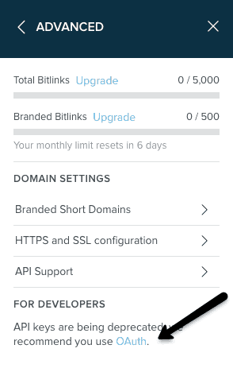
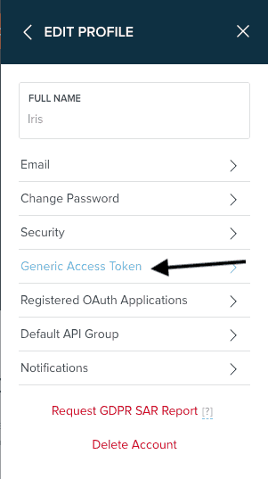

Do you have Bitly account? If not [signup](https://bitly.com/a/sign_up) right now.

If you are looking for start using the Bitly API, you will need your Oauth Access Token. To find your OAuth access token
navigate to the hamburger menu button in the top right-hand corner. From the drop down select ‘Settings’ and then
continue to the ‘Advanced Settings’ tab. Look to the bottom under ‘For Developers’ and click on the OAuth hyperlink.

If you need to generate an access token so you can use our API, you can go to <https://bitly.com/a/oauth_apps>, click
“Generic Access Token”,

Then enter your password to create the token, and then copy that token into your code or configuration.

Access tokens don’t expire (though you can expire them manually if yours leaks into the wild), so you can use the single
access token as long as you need.


