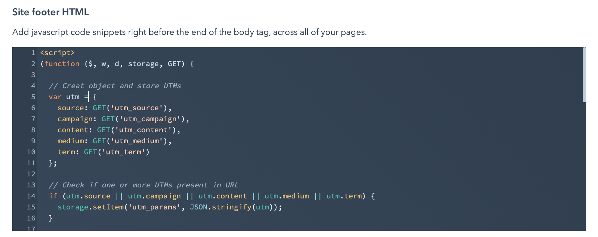

I think a Tracking URL is a good feature for marketing perspectives.

> Tracking URLs help you measure the effectiveness of your marketing campaigns by providing information to HubSpot when
> visitors access your site through the URL.
>
>Create a tracking URL when you want to track traffic from a campaign to a page with the HubSpot tracking code. Examples
> include email blasts, PPC campaigns, and banner ads. You can also create a tracking URL using
> your [meeting links](https://knowledge.hubspot.com/meetings-tool/create-and-edit-scheduling-pages).
>
> A tracking URL is a normal URL with parameters attached to it. When visitors come to your site from a tracking URL,
> HubSpot saves the information in those parameters. Learn how
> to [analyze traffic data from tracking URLs in the traffic
> analytics tool](https://knowledge.hubspot.com/reports/analyze-your-site-traffic-with-the-traffic-analytics-tool#analyze-your-traffic-using-the-utm-parameters-tab).
>
> *From [Create Tracking URL’s](https://knowledge.hubspot.com/settings/how-do-i-create-a-tracking-url)*

Meantime, it’s good idea to pass those UTM parameters to form hidden fields

> HubSpot makes it relatively easy to pass UTM parameters from a URL into hidden fields in a HubSpot form. In this blog
> post, we will outline step-by-step how to do so.
>
>
*From [How to pass UTM parameters into a HubSpot form](https://align.ly/blog/how-to-pass-utm-parameters-into-a-hubspot-form/)*

The downside of the method described in article above it’s work only with landing page, when user arrives to your page
via URL with UTM parameters, and if he goes to the next page or check some pages before actually do some actions with
form on landing page, the UTMs will be lost.

So basicly we looking to pass UTMs to form fields with property
names: `utm_source`, `utm_campaign`, `utm_content`, `utm_medium`, `utm_term`.

## Store UTM parameters in sessionStorage

### What is sessionStorage?

> The read-only **sessionStorage** property accesses a
> session [Storage](https://developer.mozilla.org/en-US/docs/Web/API/Storage) object for the
> current [origin](https://developer.mozilla.org/en-US/docs/Glossary/Origin). sessionStorage is
> similar to [localStorage](https://developer.mozilla.org/en-US/docs/Web/API/Window/localStorage); the difference is
> that while data in localStorage doesn’t expire, data in sessionStorage is
> cleared when the page session ends.
>
> *From [Web docs | MDN](https://developer.mozilla.org/en-US/docs/Web/API/Window/sessionStorage)*

### Custom JavaScript module will help store and feed form fields

First what we have to learn about JavaScript on systems like HubSpot, always encapsulate your JavaScript using Anonymous
Functions, to avoid global issues.

```js
(function () {
	// do something
})();
```

This simple encapsulation example will help you exclude your code from global variables, also will not have to override
your or third-party modules on HubSpot.

Moreover, it can make your code a bit tiny and clean if you pass some global variables to the function, like next
example.

```js
(function ($, w, d) {
	// do something
})(jQuery, window, document);
```

In the example above, we pass `jQuery`, `window`, and `document` as variables to the function which allow us to use `$`
as
`jQuery` alias, and use a short name for `window` and `document`.

To get the query string component of the URL we need a small helper function like this:

```js
function GET(param, url) {
	url = url ? url : window.location.href;
	var vars = {};
	url.replace(window.location.hash, '').replace(/[?&]+([^=&]+)=?([^&]*)?/gi, function (m, key, value) {
		vars[key] = value !== void 0 ? value : '';
	});
	return typeof vars[param] !== 'undefined' ? vars[param] : null;
}
```

This small function help us to extract query parameters from current URL. And here is how we could use the new `GET`
function to extract UTMs from URL

```js
var utm_source = GET('utm_source');
var utm_campaign = GET('utm_campaign');
var utm_content = GET('utm_content');
var utm_medium = GET('utm_medium');
var utm_term = GET('utm_term');
```

Next we have to add Event Listener to populate forms after they have been rendered on webpage, to achieve that we have
to check [HubSpot Forms API](https://legacydocs.hubspot.com/global-form-events) and check event called `onFormReady`, here is example how to use it:

```js
window.addEventListener('message', function(event) {
  if(event.data.type === 'hsFormCallback' && event.data.eventName === 'onFormReady') {
    console.log("Form Ready!");
    // do something
  }
});
```

After all, let’s combine all code we have right now to one module:

```js
(function ($, w, d, storage, GET) {
  // Creat object and store UTMs
  var utm = {
    source: GET('utm_source'),
    campaign: GET('utm_campaign'),
    content: GET('utm_content'),
    medium: GET('utm_medium'),
    term: GET('utm_term')
  };
  // Check if one or more UTMs present in URL
  if (utm.source || utm.campaign || utm.content || utm.medium || utm.term) {
    storage.setItem('utm_params', JSON.stringify(utm));
  }
  // Check if UTM parameters stored in SessionStorage
  if (typeof storage.getItem('utm_params') === 'string') {
    // Parse UTMs from SessionStorage to JSON
    var storedUTM = JSON.parse(storage.getItem('utm_params'));
    // Add Event Listener for `onFormReady` event
    w.addEventListener('message', function(e) {
      if (e.data.type === 'hsFormCallback' && e.data.eventName === 'onFormReady') {
        // Find all HubSpot forms on the page
        var scope = $(d).find('form[data-form-id]');
        // Check if UTM parameter exists and populate form hidden input fields
        if (storedUTM.source) {
          scope.find('[name="utm_source"]').val(storedUTM.source).change();
        }
        if (storedUTM.campaign) {
          scope.find('[name="utm_campaign"]').val(storedUTM.campaign).change();
        }
        if (storedUTM.content) {
          scope.find('[name="utm_content"]').val(storedUTM.content).change();
        }
        if (storedUTM.medium) {
          scope.find('[name="utm_medium"]').val(storedUTM.medium).change();
        }
        if (storedUTM.term) {
          scope.find('[name="utm_term"]').val(storedUTM.term).change();
        }
      }
    });
  }
})(jQuery, window, document, sessionStorage, function (param, url) {
  url = url ? url : window.location.href;
  var vars = {};
  url.replace(location.hash, '').replace(/[?&]+([^=&]+)=?([^&]*)?/gi, function (m, key, value) {
    vars[key] = value !== void 0 ? value : '';
  });
  return typeof vars[param] !== 'undefined' ? vars[param] : '';
})
```

### Installation to HubSpot website

Open Settings > Website(sidebar) > Pages(sidebar) > Templates(tab) > Site footer HTML(section) and paste the final code toSite footer HTML editor between script tags

```html
<script>
(function(){
  // do something
})();
</script>
```



*Final result should look like screenshot*

The same method could be used for any websites(Webflow, WordPress, Wix, Static, etc…) who use HubSpot forms.

This is it! Next time, I will cover the way [how to store UTM parameters in cookie files](/blog/keep-track-utm-parameters-for-hubspot-forms-like-cookie-monster/).

