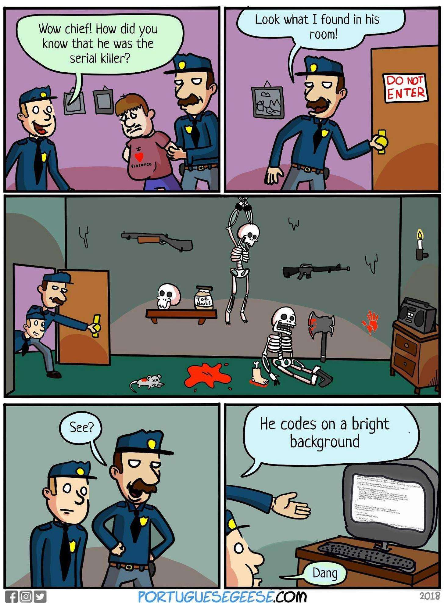
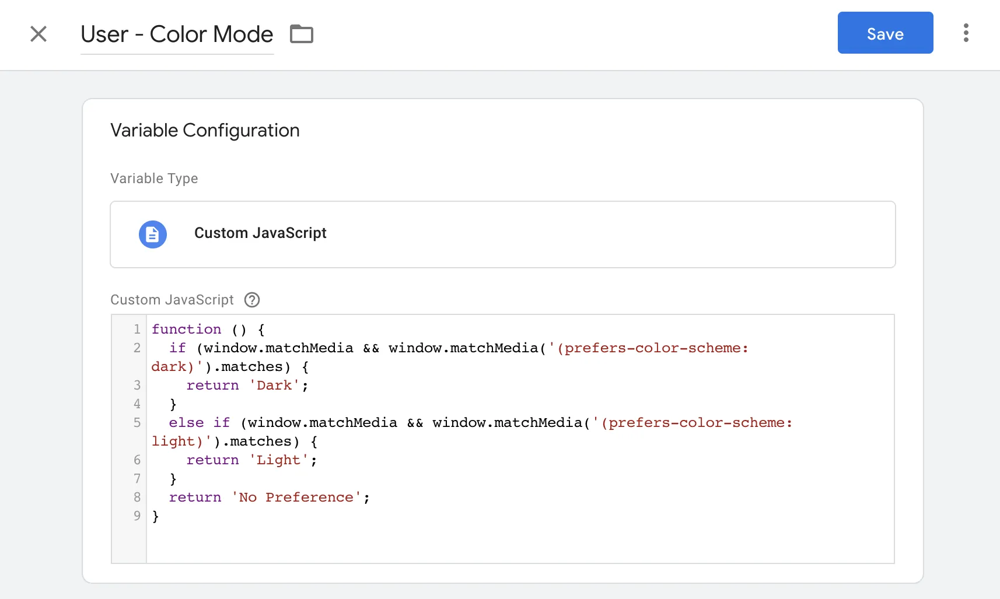
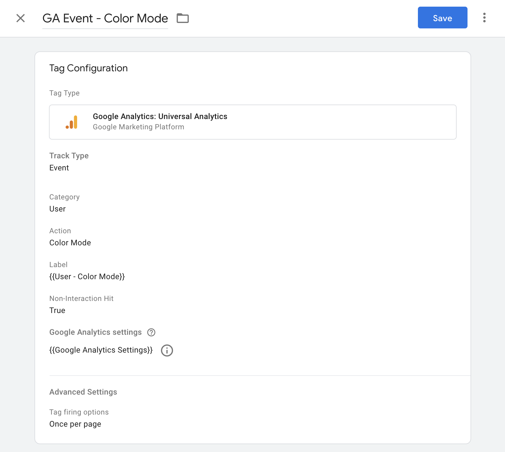
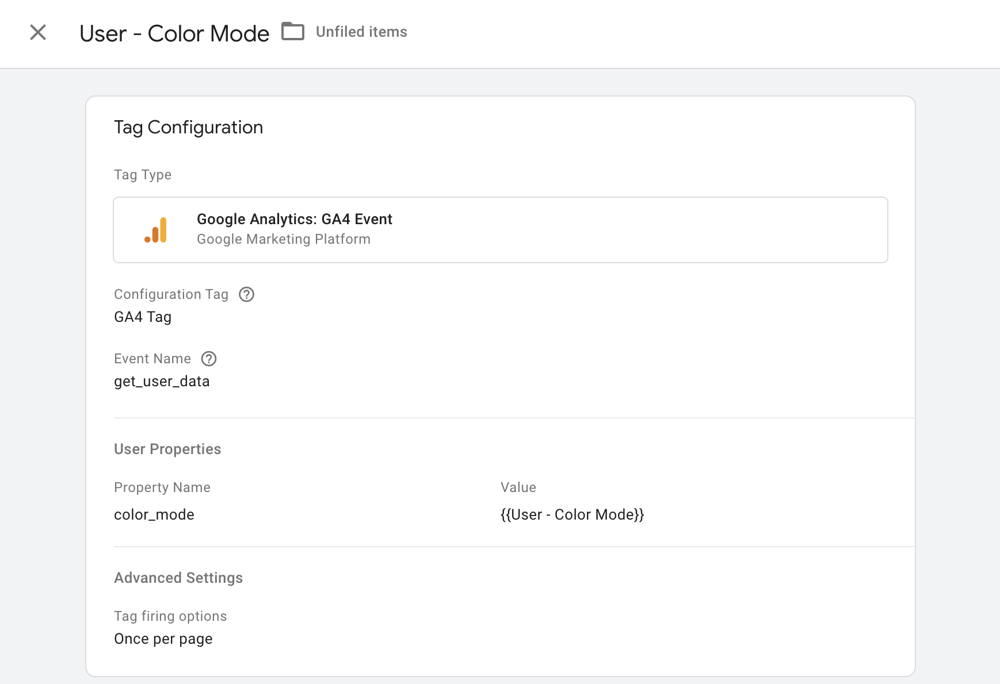
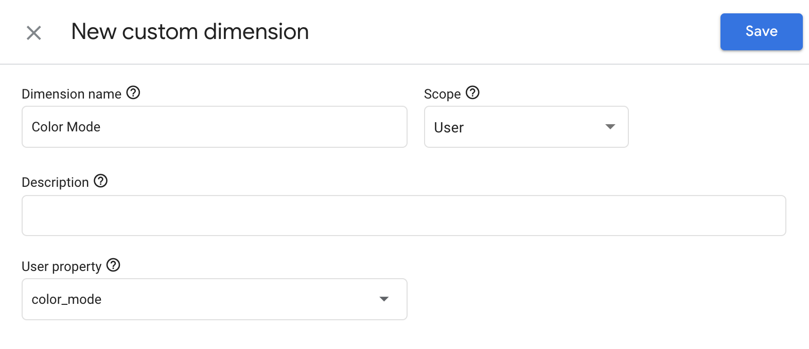

As developer, I do prefer dark schema for system and all my apps except Gmail on mobile 🙂 Emails still not so friendly for dark theme mode 🙂



## Detect with CSS media query
The prefers-color-scheme CSS media feature is used to detect if the user has requested a light or dark color theme.

> The user might indicate this preference through an operating system setting (e.g. light or dark mode) or a user agent setting.
>
> [From MDN Web Docs](https://developer.mozilla.org/en-US/docs/Web/CSS/@media/prefers-color-scheme)

### prefers-color-scheme: dark

Indicates that a user has notified the system that they prefer an interface that has a dark theme.

When you want a style that applies to users with dark mode turned on, add your style inside media query below. If we want the black background and white text for dark mode users, we will type something like this:

```css
@media (prefers-color-scheme: dark) {
	body {
		background-color: #000000;
		color: #FFFFFF;
	}
}
```

### prefers-color-scheme: light

Indicates that the user has notified the system that they prefer an interface that has a light theme.

When you want a style that applies to users with light mode turned on, add your style inside media query below. If we want the white background and black text for light mode users, we will type something like this:

```css
@media (prefers-color-scheme: light) {
	body {
		background-color: #FFFFFF;
		color: #000000;
	}
}
```

## Detect with JS

## window.matchMedia()

> The Window interface’s matchMedia() method returns a new MediaQueryList object that can then be used to determine if the document matches the media query string, as well as to monitor the document to detect when it matches (or stops matching) that media query.
>
> [From MDN Web Docs](https://developer.mozilla.org/en-US/docs/Web/API/Window/matchMedia)

Here is simple example how to use it:

```js
if (window.matchMedia && window.matchMedia('(prefers-color-scheme: dark)').matches) {
    // dark mode
} else {
	// light mode or not supported
}
```

To watch for changes:

```js
window.matchMedia('(prefers-color-scheme: dark)').addEventListener('change', e => {
    const newColorScheme = e.matches ? "dark" : "light";
});
```

## Detect with GTM and track down with GA

Google Tag Manager could detect user’s theme color preferences, and after send that data to Google Analytics for example.

### Define GTM dataLayer variable

Open Google Tag Manager Dashboard, on sidebar select tab Variables and add new User-Defined Variables

Select Custom JavaScript and copy-paste code from below:

```js
function () {
	if (window.matchMedia && window.matchMedia('(prefers-color-scheme: dark)').matches) {
		return 'Dark';
	}
	else if (window.matchMedia && window.matchMedia('(prefers-color-scheme: light)').matches) {
		return 'Light';
	}
	return 'No Preference';
}
```

Result should look like a screenshot.



### Tracking with GA Universal

To track user color mode with Google Analytics Universal, we need to create a tag in GTM like screenshot below, and fire it on PageView trigger.



### Tracking with GAv4

Not a secret, Google Analytics v4 has new way to collect data, and in this case, we need to create a tag in GTM and also create custom dimension in Google Analytics.





After all set, in 48h, you will start to see User color mode in your Google Analytics reports.

This is it, hope this article help to learn something new, GTM and GA could help us to collect a lot of different information, to learn how to do that, I strongly recommend checking [Analytics Mania](https://www.analyticsmania.com/) where Julius teaching how to use GTM and GA in god mode 😉

