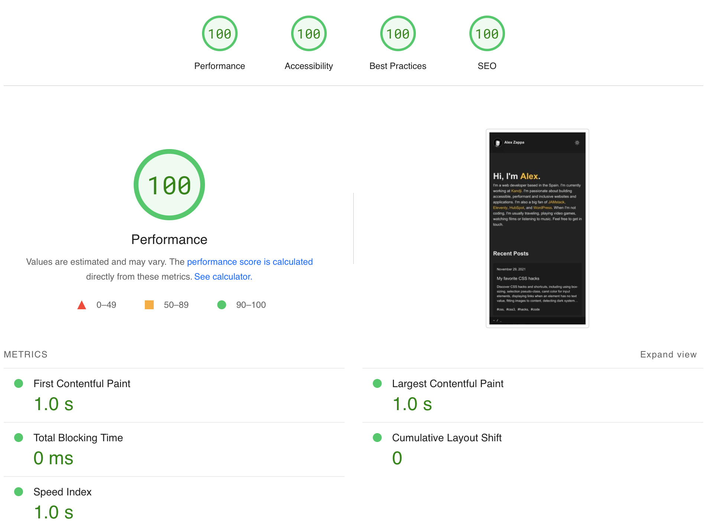

Hey there, lovely readers! Today, I am absolutely thrilled to share with you my very first blog post on my newly
migrated website! After careful consideration and research, I decided to move away from WordPress and embrace the world
of static website generation with 11ty. This decision was driven by my desire for simplicity, performance, and increased
control over my website. In this post, I will dive into the reasons behind my migration, the benefits of using 11ty, and
my initial thoughts on this exciting new journey. So, grab a cup of coffee and let's get started!

## Why I Switched from WordPress to 11ty: Enhancing Performance and Simplifying Maintenance

When I embarked on my blogging journey, I experimented with various platforms including Blogger, WordPress, Jekyll, and
Ghost. Initially, WordPress seemed like the obvious choice with its user-friendly interface, extensive plugin options,
and vibrant community. However, over time, I began to encounter some limitations. WordPress felt bloated, resulting in
sluggish website loading times, and the constant plugin updates became tiresome. It was then that I came across 11ty and
the concept of static website generation, which intrigued me with its promise of swift loading times and streamlined
upkeep. The idea of having complete control over my website's codebase and including only what I truly needed greatly
appealed to me. Thus, the decision to switch to 11ty was born.

## The Benefits of Using 11ty

Now that I have migrated my website, I can already see some major benefits of using 11ty. Firstly, the performance gains
are remarkable. With static website generation, there is no need for server-side processing or database queries,
resulting in lightning-fast loading times. This not only enhances the user experience but also improves search engine
optimization. Secondly, the simplicity of 11ty is a refreshing change. The configuration is straightforward, the
templating language is intuitive, and the documentation is extensive. I feel more confident and in control of my website
than ever before. Lastly, the ability to version control my website's codebase using Git is invaluable. I can easily
track changes, collaborate with others, and revert back to a previous version if needed.

## My Initial Thoughts and Observations

As with any new venture, there is a learning curve that comes with using 11ty. However, I must say that the transition
has been relatively smooth. The initial setup was a breeze, thanks to the excellent documentation provided by the 11ty
community. Migrating my old blog posts to the new platform was a bit time-consuming, but it allowed me to revisit my
content and update it along the way. One of the things that excites me the most about 11ty is the flexibility it offers.
Whether I want to create a simple blog, a full-fledged e-commerce site, or a documentation portal, 11ty can accommodate
all my needs. I am eager to dive deeper into its features and explore the endless possibilities it presents.

## Conclusion

In conclusion, the decision to migrate my website from WordPress to 11ty has been one of the best I have made for my
online presence. The performance gains, simplicity, and control over my website have exceeded my expectations. Even
though there was a learning curve, the transition has been smooth, and I am excited to continue the journey with 11ty. I
highly recommend considering static website generation with 11ty if you are looking to enhance your website's
performance and take control of your online presence.

## Future Plans: Enhancing Navigation, Adding Search Functionality, and Implementing a Twitter-based Comment System

As I look ahead to the future, I am excited to outline my plans for further improving my website. I have identified a
few key areas that I intend to focus on for future updates:

1. Navigation Bar and Footer Navigation: To enhance the user experience and make it easier for visitors to navigate through
my website, I plan to update both the main navigation bar and the footer navigation. This will involve streamlining the
menu structure, improving accessibility, and ensuring a seamless browsing experience across different devices.
1. Search Page: One of my top priorities is to implement a search functionality on my website. By incorporating a search
page, users will be able to easily find specific content or topics of interest. This will not only save time for users
but also improve the overall usability and accessibility of the site.
1. Twitter-based Comment System: I am excited to leverage the power of social media and introduce a comment system based on
Twitter threads. This approach will not only provide a familiar and user-friendly commenting experience but also
encourage discussions and engagement from a wider audience. By integrating Twitter threads, users will be able to share
their thoughts, ask questions, and interact with others, creating a dynamic and interactive platform.

These planned updates reflect my commitment to continuously improving my website and providing an exceptional user
experience. I believe that by focusing on navigation enhancements, implementing a search page, and incorporating a
Twitter-based comment system, I will be able to create a more engaging and content-rich environment for my visitors.
Stay tuned for more blog posts where I will be sharing tips, tricks, and insights on using 11ty to its full potential.
Until next time, happy coding!


