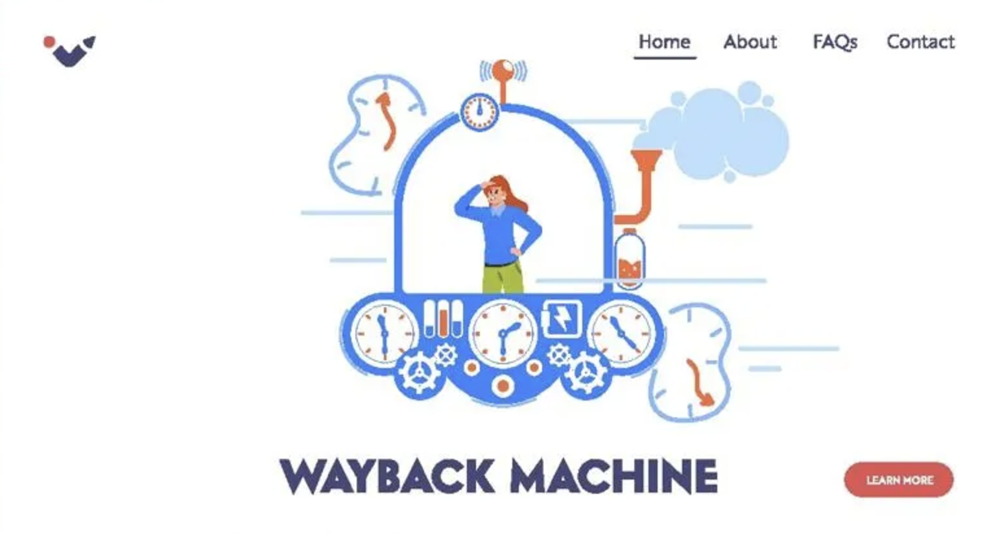

In October 10. 2024 I was looking an archived copy of the website on the [Wayback Machine](https://web.archive.org/) and found that the web archive is down.



Shortly I started looking at internet media, what's happened to one of the useful resources in the internet, and found Wayback Machine is down for a reason of DDoS attack.

Here is a [Forbes article about this incident](https://www.forbes.com/sites/daveywinder/2024/10/10/internet-hacked-wayback-machine-down-31-million-passwords-stolen/).

This case brings me to the idea of creating a personal web archiving tool that allows you to capture and explore snapshots of webpages over time—like the Wayback Machine, but as your own personal Time Machine.

## Meet the webChronicle

The [webChronicle](https://webchronicle.dev/) is a simple tool that allows you to capture and explore snapshots of webpages over time. It's like the Wayback Machine, but as your own personal Time Machine.


### How it works?

The webChronicle builds on the [Eleventy](https://www.11ty.dev/) static site generator and the [website-scraper](https://www.npmjs.com/package/website-scraper) package to capture and store snapshots of webpages.

As a result you will have a static website that you can host on [Netlify](https://www.netlify.com/) or [Vercel](https://vercel.com/) to explore snapshots of webpages over time.

<div class="flex flex-wrap gap-6 not-prose">
  <a href="https://app.netlify.com/start/deploy?repository=https://github.com/reatlat/webchronicle">
    
    <span class="sr-only">Netlify Deploy</span>
  </a>
  <a href="https://vercel.com/import/project?template=https://github.com/reatlat/webchronicle">
    
    <span class="sr-only">Vercel Deploy</span>
  </a>
</div>

You also may deploy this project to other platforms like Heroku, AWS, Cloudflare Pages or Google Cloud.

### How to use?

1. Clone the [webChronicle repository](https://github.com/reatlat/webchronicle/).
2. Install dependencies with `npm install`.
3. Update `webchronicle.config.js` with your configuration:
    ```javascript
    module.exports = {
      ...
      urls: [
        'https://example.com',
        'https://example.org',
      ],
      urlFilter: (url) => {
        return url.includes('example.com') || url.includes('example.org');
      },
      ...
    };
    ```
   Full configuration options are available in the [Options](https://github.com/website-scraper/node-website-scraper?tab=readme-ov-file#options) section.
4. Run the scraper:
    ```bash
    npm run scraper
    ```
5. Commit the changes to your repository:
    ```bash
    git add ./scrapped-websites
    git commit -m "Scrapped websites"
    git push
    ```
6. Deploy the project to your preferred platform or run it locally `http://localhost:8080`:
    ```bash
    npm run start
    ```
7. Explore the snapshots of the webpages over time.
8. Enjoy! 🎉

### Live Demo

You can explore the live demo of the webChronicle at [webChronicle](https://webchronicle.dev/).

## Credits

Special thanks to [James&nbsp;Dancer](https://www.linkedin.com/in/james-dancer/) for the inspiration behind the name—your idea was spot on!

## Contributing and Source Code

You can find the source code of the webChronicle on [GitHub](https://github.com/reatlat/webchronicle/).

If you notice an issue, feel free to [open an issue](https://github.com/reatlat/webchronicle/issues).

Happy Holidays, and Thanks for reading! 🙏
