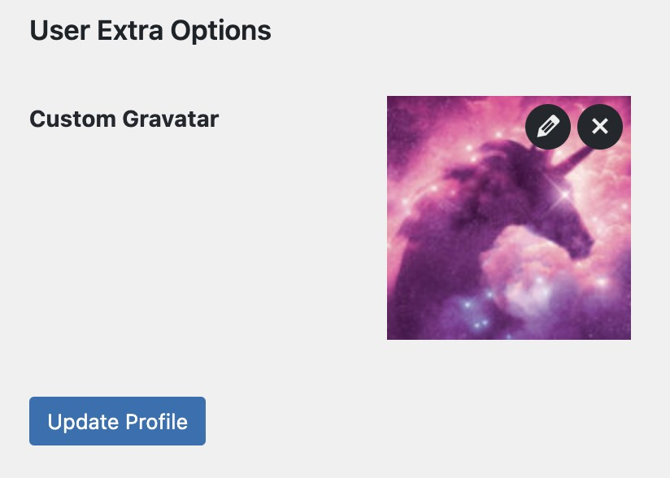

WordPress is a powerful platform that allows you to create and manage a wide variety of websites. One of the key
features of WordPress is its user management system, which allows you to create user accounts and assign different roles
and permissions to each user.

By default, WordPress uses Gravatar to display user avatars, but you may want to add custom avatar functionality to your
site to make it more attractive to users, or maybe you want to give users the option to upload their own avatar images.
Or maybe the author no have access to Gravatar anymore...

In this blog post, I want to share with you a simple and quick solution to add custom avatar functionality to your WordPress.

## Advanced Custom Fields

To add custom avatar functionality to your WordPress site, we will use the Advanced Custom Fields (ACF) plugin. ACF is a powerful plugin that allows you to create custom fields for posts, pages, and users.

First, you need to install and activate the Advanced Custom Fields plugin on your WordPress site. Once you have installed the plugin, you can add a code snippet to your theme's `functions.php` file to create a custom field for user avatars. See the code snippet below:

```php
if (class_exists('ACF')) {

    add_action('acf/include_fields', function () {
        if (!function_exists('acf_add_local_field_group')) {
            return;
        }

        acf_add_local_field_group(array(
            'key' => 'user_extra_options',
            'title' => 'User Extra Options',
            'fields' => array(
                array(
                    'key' => 'user_extra_options__custom_gravatar',
                    'label' => 'Custom Gravatar',
                    'name' => 'custom_gravatar',
                    'aria-label' => '',
                    'type' => 'image',
                    'instructions' => '',
                    'required' => 0,
                    'conditional_logic' => 0,
                    'wrapper' => array(
                        'width' => '',
                        'class' => '',
                        'id' => '',
                    ),
                    'return_format' => 'id',
                    'library' => 'all',
                    'min_width' => '',
                    'min_height' => '',
                    'min_size' => '',
                    'max_width' => '',
                    'max_height' => '',
                    'max_size' => '',
                    'mime_types' => '',
                    'preview_size' => 'thumbnail',
                ),
            ),
            'location' => array(
                array(
                    array(
                        'param' => 'user_form',
                        'operator' => '==',
                        'value' => 'all',
                    ),
                ),
            ),
            'menu_order' => 0,
            'position' => 'normal',
            'style' => 'default',
            'label_placement' => 'top',
            'instruction_placement' => 'label',
            'hide_on_screen' => '',
            'active' => true,
            'description' => '',
            'show_in_rest' => 0,
        ));
    });

    function sunnypixels_custom_avatar($avatar, $id_or_email, $size, $default, $alt, $args)
    {
        $id = sunnypixels_get_user_id($id_or_email);

        if (!$id)
            return $avatar;

        $custom_avatar = get_user_meta($id, 'custom_gravatar', true);

        if ($custom_avatar) {
            $custom_avatar = wp_get_attachment_image_src($custom_avatar)[0];
            $avatar = "";
        }

        return $avatar;
    }

    function sunnypixels_custom_avatar_url($url, $id_or_email, $args)
    {
        $id = sunnypixels_get_user_id($id_or_email);

        if (!$id)
            return $url;

        $custom_avatar = get_user_meta($id, 'custom_gravatar', true);

        if ($custom_avatar) {
            $custom_avatar = wp_get_attachment_image_src($custom_avatar)[0];
            $url = $custom_avatar;
        }

        return $url;
    }

    function sunnypixels_get_user_id($id_or_email)
    {
        if (is_numeric($id_or_email))
            return $id_or_email;

        if (is_object($id_or_email))
            return $id_or_email->user_id;

        if (is_string($id_or_email))
            return get_user_by('email', $id_or_email) ? get_user_by('email', $id_or_email)->ID : 0;

        return 0;
    }

    add_filter('get_avatar', 'sunnypixels_custom_avatar', 100500, 6);
    add_filter('get_avatar_url', 'sunnypixels_custom_avatar_url', 100500, 3);

} else {

    add_action('admin_notices', function () {
        echo '<div class="notice notice-warning is-dismissible"><p>Advanced Custom Fields plugin is required for Custom Gravatar functionality.</p></div>';
    });

}
```

You can find copy of [this snippet here](https://gist.github.com/reatlat/a84798425b45ad4f18f2b5be9e13a3ff).

The result of this code snippet is a new field in the user profile page, where users can upload their custom avatar images. The custom avatar images will be displayed instead of the Gravatar images on the site.



## Alternative Solutions

if you don't want to edit your WordPress theme, you can use a plugin variation of this solution, I coded for you. You can find it [here](https://github.com/sunnypixels-io/wp-custom-gravatar).

I hope this blog post helps you add custom avatar functionality to your WordPress site. If you like this plugin, please consider to give it a star on GitHub.

